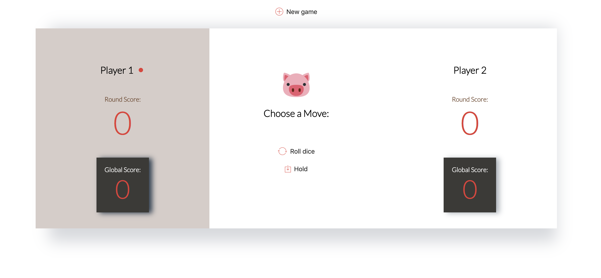

# Pig Game
This repo is just my own mini task in which allowed me to practice barebones HTML/CSS/Javascript.

# Rules
- there is a max of two players playing
- there is a global score, first to reach a global score of **50** wins the game
- there is a round score, as these two players will be playing in rounds
- in each turn, a player rolls a dice, they can roll the dice as many times as they wish, and whatever is rolled gets added to their ROUND score
- however if they roll a ONE, then their ROUND score goes back to zero and its the next players turn.
- this is why the player can choose to HOLD, and their ROUND score will be saved and added to the GLOBAL score.
- always starts with player 1

# Screenshot

# Configuration
- in app.js, one can modify the max game score to be something other than the default of 50.
